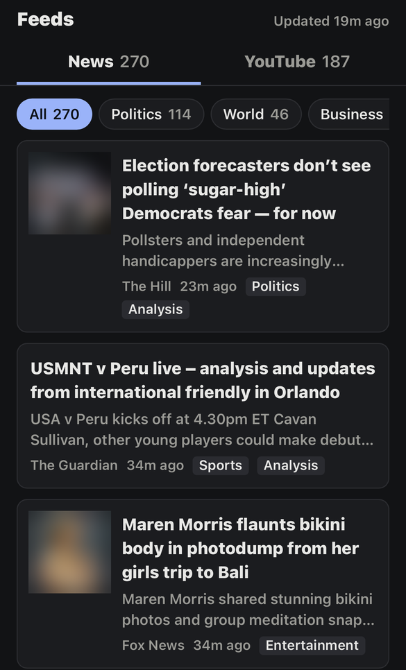

# jev-feed-filter

Filters news and YouTube feeds and writes one static page, `out/index.html`, with a News tab
and a YouTube tab.

- **Your interests:** you describe them in plain English, and each story or video is filed under
  the one it matches best.
- **News**: shows stories that match an interest, plus a handful of **major news** events: ones
  that at least three outlets cover and Jev rates as major, shown once each. Everything else is
  hidden, as are paywalled sites, strongly slanted stories (from either side), promotional pieces,
  and any keywords or topics you list.
- **YouTube**: drops Shorts and livestreams from your subscriptions, files the rest under your
  interests (or "Other"), and labels each with its length and type (tutorial, review, explainer,
  and so on).

<p align="center"></p>

Exact checks (paywalled domains, keywords, video length, Shorts, livestreams) are done in plain
code. Judgment calls (interests, significance, story format, slant, video type) are made by
[Jev](https://docs.typesafe.ai), TypeSafe's "System One" model. Jev answers fixed questions with
probabilities instead of writing text, so it's fast and cheap: a full pass over a few hundred
stories and videos costs around a cent.

On the page:
- **Cards:** each item shows its image or video thumbnail (when the feed has one), the feed's
  summary, the outlet, how long ago it was published, and chips for its topic and format.
  Videos also show their length.
- **Filter buttons:** show one interest at a time, plus **Major news** on the News tab and
  **Other** on the YouTube tab.
- **New since last run:** items that arrived since the previous run are marked **New** and get
  their own filter button. The page remembers what it has shown in `state/seen.json`, for 14 days.
- **Hidden section:** each tab has a collapsed **Hidden** section listing every dropped item and
  the reason, so you can see when a filter is wrong.

The page is a single file with a little inline JavaScript, so any static file server can serve
the `out/` folder. Its layout lives in `page.html`.

## Setup

You need [uv](https://docs.astral.sh/uv/) and two keys:

| Environment variable | What it's for | Where to get it |
|---|---|---|
| `OPENROUTER_API_KEY` | Calling Jev | [openrouter.ai](https://openrouter.ai) (Jev is `~typesafe/jev-latest`) |
| `YOUTUBE_API_KEY` | Reading subscriptions and video details | Google Cloud console, YouTube Data API v3 |

The OpenRouter key is also used for embeddings, to spot stories about the same event.

Then:

```
cp config.example.toml config.toml   # then edit it
uv run portal.py
```

`uv` installs the dependencies listed at the top of `portal.py`.

If you use [gopass](https://github.com/gopasspw/gopass), you can set `gopass_key` in a config
section instead of an environment variable. The environment variable wins when both are set.

**Using TypeSafe directly instead of OpenRouter:** in the `[jev]` section, set
`base_url = "https://api.typesafe.ai"`, `model = "jev-latest"` and
`api_key_env = "TYPESAFE_API_KEY"`.

## Configuration

Everything is in `config.toml`:

- **`[news]`**: `feeds` (each a URL, or `{ name = "BBC", url = "..." }` to set the outlet name
  shown on the page), `days` to look back, `paywall_domains`, `hide_keywords`, `hide_topics`,
  `hide_formats` for major news and `interest_hide_formats` for your interests (any of
  `straight_news`, `analysis`, `opinion`, `promotional`), and `major_min_outlets`.
- **`[[interests]]`**: one block per interest, in button order: a `name`, what it's `about`, and
  optionally `hide_routine_business = true` to hide funding rounds, earnings and the like.
- **`[jev]`**: model, endpoint, key, concurrency, and the cutoffs (probabilities from 0 to 1):
  - `interest_match`: file an item under an interest.
  - `major_news`: count an event as major or historic news.
  - `strong_slant`: hide a story that is strongly one-sided.
  - `topic_match`: hide an item about a listed topic.
  - `woo`: hide astrology, crystals, manifestation and similar claims.
  - `routine_business`: hide routine business news under interests that ask for it.
- **`[embeddings]`**: the model used to spot stories about the same event, and `same_event`, how
  close in meaning two stories must be.
- **`[youtube]`**: `channel_handle` (leave empty to skip YouTube), `days` to look back,
  `hide_keywords`, `hide_topics`.

Topics are plain English, e.g. `hide_topics = ["celebrity gossip", "sports betting"]`.

## How it works

**News.** Stories come from RSS feeds. For Google News, the real publisher's domain is read from
each item's `<source>` tag, so paywalled sites are caught without opening the link. Stories that
pass the paywall and keyword checks go to Jev. It gets one request per story with the headline,
the outlet and the feed's summary, and it scores each interest, significance, format, slant, woo,
routine business and each hidden topic. Stories that match no interest are grouped by event using
embeddings: each event is built around its most significant story, and stories close enough in
meaning to that one join it. An event becomes a **Major news** card when enough outlets cover it
and Jev rates it likely major; its other stories are hidden as "same event".

**YouTube.** Your channel list is read from your **public** subscription list. A plain API key
can't read private subscriptions, so set them to public in YouTube's privacy settings. Recent
videos come from each channel's public RSS feed, which costs no API quota but only shows the
latest 15 videos per channel. Video length and live status come from the Data API, and a full
pass uses about 15 of the default 10,000 daily units.
- **Livestreams:** anything live, upcoming, or a past stream is hidden. Premieres look the same
  to the API, so they are hidden too.
- **Shorts:** Shorts can be up to 3 minutes long, so length alone doesn't identify them. For
  videos of 3 minutes or less, the tool requests `youtube.com/shorts/<id>`, which loads for a
  Short and redirects for anything else. That address isn't part of the official API.

## Stored history

Every run records every item, shown or hidden, in `state/items.db` (SQLite, git-ignored), so you
can later check how well the rules are doing:

- **`items`**: one row per story or video (`section` is `news` or `youtube`, `id` is the link or
  video id), with `first_seen` and `last_seen`.
- **`rules`**: each distinct set of rules, as JSON: the Jev questions, cutoffs and hide lists,
  plus `RULES_REVISION` from `portal.py`, which you bump when you change the code's logic.
- **`judgements`**: one row per item per set of rules: Jev's full answers with probabilities
  (`answers`, empty for items dropped before Jev), the Jev version, topic, chips, hide reasons
  and `shown`. Changing the rules starts new rows, so old and new judgements can be compared.
- **`runs`**: per run, the rules used and how many items were shown.

For example, the stories hidden for slant in the last week:

```
python3 -c "import sqlite3; db = sqlite3.connect('state/items.db')
for r in db.execute('''select i.title, j.hidden_because from judgements j join items i using (section, id)
    where j.hidden_because like '%slant%' and i.first_seen > unixepoch() - 7 * 86400'''): print(*r)"
```

## Limitations

- **Accuracy:** Jev reads text literally, and its answers vary slightly from run to run, so items
  near a cutoff can flip. If results look wrong, reword the option descriptions in
  `NEWS_FORMATS`, `SLANT_LEVELS` or `VIDEO_FORMATS` in `portal.py` before changing the cutoffs.
- **Slant from headlines:** slant is judged from the headline and summary only, not the full
  article. Google News feeds give only a headline.
- **Opinion format:** the "opinion" format also catches things like sports picks and reviews.
- **Prompt injection:** a headline or video description written to steer the model can move its
  answer.

## Privacy and terms

- **What gets sent where:** every headline, summary, video title and description that is judged
  is sent to OpenRouter and TypeSafe.
- **Personal use only:** the Google News feed and most publisher feeds are offered for personal,
  non-commercial use in a feed reader. This tool is meant for each person to run for themselves.
  Don't host the generated page publicly; a private network you control
  is fine. `out/` is git-ignored for that reason.

## License

MIT, see [LICENSE](LICENSE).
